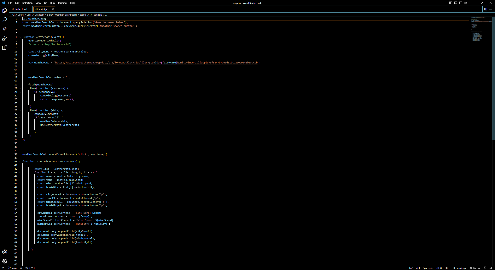

# 5_Day_Weather_dashboard
This repo contains an application that will display the weather for the current day and 4 future dates, and will use local storage to store any persistent data. 

# Screenshots

Below are screenshots of Javascript, CSS, HTML and the deployed application.

# Links 

Below are the links to the Github Repository and also the Deployed Application.

Github Repository : https://github.com/Ervin543/5_Day_Weather_dashboard
Deployed Application : https://ervin543.github.io/5_Day_Weather_dashboard/
